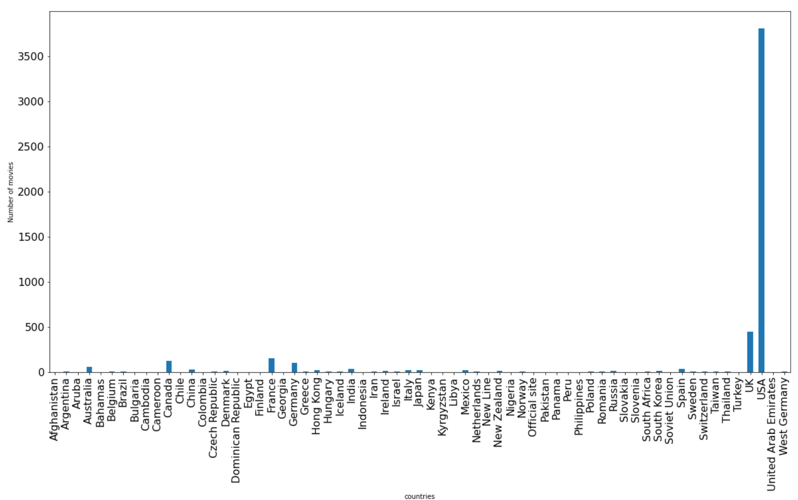
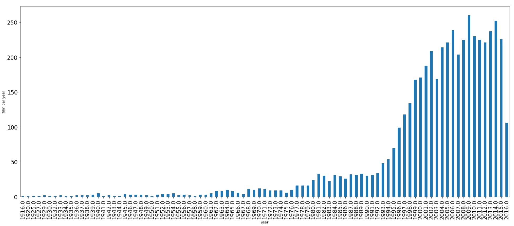
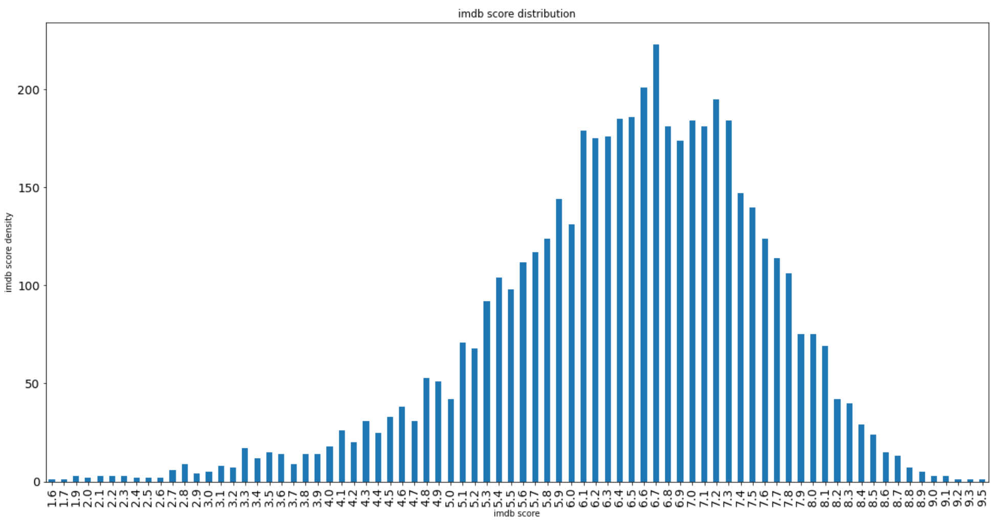
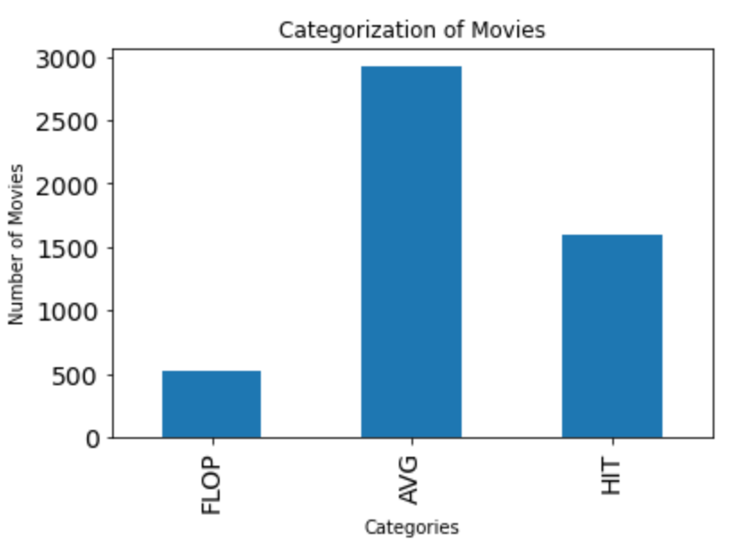
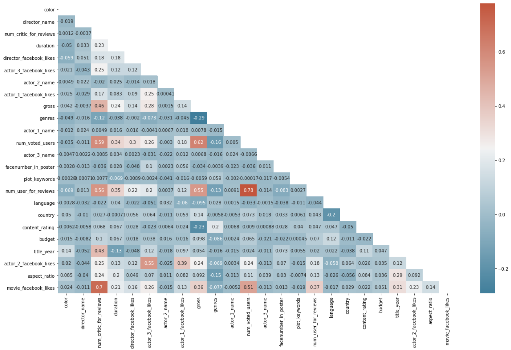
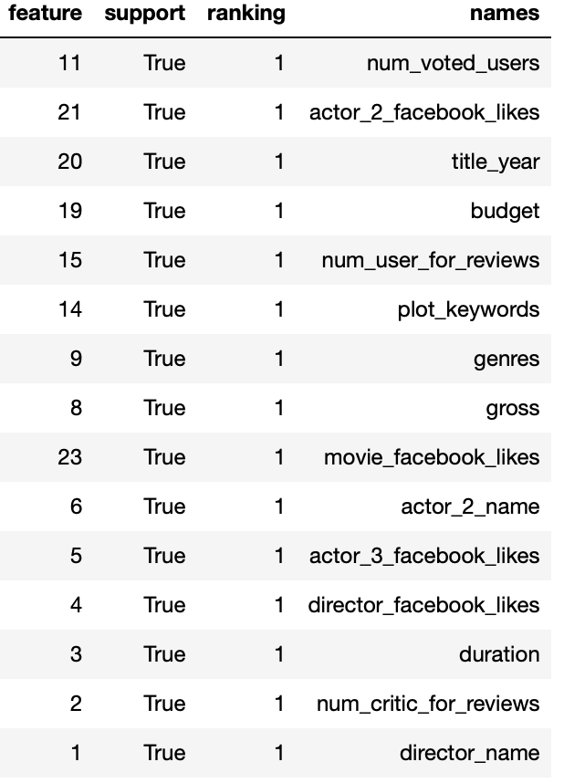

# Movie Success Prediction
A machine learning application to predict movie success. A movie's success can be interpreted in various ways, here we're considering the IMDB rating as a metrics of success. In particolary instead of just IMDB score, with the help of other parameters we're going to predict whether a movie is Hit, Avg or Flop.

|IMDB Score|	Classify|
| :---   | :---  |
|1-5|Flop Movie|
|5-7|Average Movie|
|7-10|Hit Movie|

## Table of contents:
- [Data  Description](#data-description)
- [Data Exploration](#data-exploration)
- [Data Preprocessing](#data-preprocessing)
  - [Target Variable](#target-variable)
  - [Missing Values](#missing-values)
  - [Duplicates Values](#duplicates-values)
  - [Categorical Data](#categorical-data)
  - [Correlation](#correlation)
- [Classification Model Building](#classification-model-building)
  - [Data Split](#data-split)
  - [Train Test Split](#train-test-split)
  - [Feature Scaling](#feature-scaling)
  - [Feature Selection](#feature-selection)
- [Classification Models Results](#classification-models-resutls)
- [Conclusion](#conclusion)
- [Authors](#authors)
- [References](#refernces)

## Data Description
The dataset is from Kaggle website (IMDb 5000 Movie Dataset). It contains 28 variables for 5043 movies, spanning across 100 years in 66 countries. There are 2399 unique director names, and thousands of actors/actresses. “imdb_score” is the response variable while the other 27 variables are possible predictors.

|Column Name | Description|
| :---   | :---  |
|movie_title|Title of the Movie|
|duration|Duration in minutes|
|director_name|Name of the Director of the Movie|
|director_facebook_likes|Number of likes of the Director on his Facebook Page|
|actor_1_name|Primary actor starring in the movie|
|actor_1_facebook_likes	|Number of likes of the Actor_1 on his/her Facebook Page|
|actor_2_name|Other actor starring in the movie|
|actor_2_facebook_likes	|Number of likes of the Actor_2 on his/her Facebook Page|
|actor_3_name|Other actor starring in the movie|
|actor_3_facebook_likes|Number of likes of the Actor_3 on his/her Facebook Page|
|num_user_for_reviews|Number of users who gave a review|
|num_critic_for_reviews|Number of critical reviews on imdb|
|num_voted_users|Number of people who voted for the movie|
|cast_total_facebook_likes|Total number of facebook likes of the entire cast of the movie|
|movie_facebook_likes|Number of Facebook likes in the movie page|
|plot_keywords|	Keywords describing the movie plot|
|facenumber_in_poster|Number of the actor who featured in the movie poster|
|color|Film colorization. ‘Black and White’ or ‘Color’|
|genres|Film categorization like ‘Animation’, ‘Comedy’, ‘Romance’, ‘Horror’, ‘Sci-Fi’, ‘Action’, ‘Family’|
|title_year|The year in which the movie is released (1916-2016)|
|language|English, Arabic, Chinese, French, German, Danish, Italian, Japanese etc|
|country|Country where the movie is produced|
|content_rating|Content rating of the movie|
|aspect_ratio|Aspect ratio the movie was made in|
|movie_imdb_link|IMDB link of the movie|
|gross|Gross earnings of the movie in Dollars|
|budget|Budget of the movie in Dollars|
|imdb_score|IMDB Score of the movie on IMDB|

## Data Exploration
Countries distribution

Year distribution

IMDB Score distribution

## Data Preprocessing
### Target Variable
Categorising the target varible  in such a way that IMDB score between 1 and 5 is FLOP , between 5 and 7 is AVG, between 7 and 10 is HIT.

Movies distribution

### Missing Values
Every datset have some missing values, all the samples that having missing values are dropped
### Duplicates Values
All duplicates are dropped
### Categorical Data
All the categorical columns and the columns with text data are being Label Encodeded using LabelEncoder from Sklearn library

### Correlation
To find out whether there is any relation between variables, or multicollineariaty, we plot the correlationa matrix.Then we define a function to remove variables having High Collinearity.

matrix without multicollineariaty

## Classification Model Building
### Data Split
Splitting the data into X and y where X contains Indepentent variables and y contain Target/Dependent variable.
### Train Test Split
The train-test split is a technique for evaluating the performance of a machine learning algorithm, the dataset is divided into two subsets :
Train subset: used to fit the machine learning model
Test subset: used to evaluate the fit machine learning model.
Splitting the dataset into 70:30 (Train:Test) ratio using the test_train_split function in Sklearn library
### Feature Scaling
Feature scaling is used to normalize the range of independent features of data.
Standardization: Standardize features by removing the mean and scaling to unit variance.
The standard score of a sample x is calculated as:
z = (x - u) / s
where u is the mean of the training subset, and s is the standard deviation of the training subset.
### Feature Selection
Feature selection is the process of reducing the number of independent features to reduce the computational cost of modeling and to improve the performance of the model.
The aim is to develop a trained machine learning model with the minimal required feature and which can predict the data points with acceptable accuracy.

Recursive Feature Elimination Cross-Validated (RFECV) feature selection: in selecting the optimal number of features, the estimator is trained and the features are selected via the coefficients, or via the feature importances. The least important features are removed. This process is repeated recursively until the optimal number of features is obtained.

Feature importance for Random Forest:

## Classification Models Results
|Classifier|Accuracy|
| :---   | :---  |
|Random Forest|0.73|
|Logostic Regression|0.71|
|SVM|0.71|
|Decision tree|0.68|
|KNN|0.68 |
|Naive Bayes|0.67|

## Conclusion
The Random Forest algorithm yielded the best accuracy.

This score is good, but not ideal. It should be higher to be able to confidently predict a movie’s success.

As in the Random Forest the num_voted_users feature is also in other algorithms is the main feature, so the number of people who voted for the movie influences the movie success. In general the popularity, of the film and of his actors, seems to be the mean to make a successful movie.

## Authors
This project has been developed by **Gazaleh Amini**,  **Yaba Meliane Epiphanie Ayebah** and **Sara Layachi**, as assignment of the 'Programming(Python)' course of University of Milano.

## References
- https://www.kaggle.com/carolzhangdc/imdb-5000-movie-dataset
- https://www.kaggle.com/harshadeepvattikunta/predicting-movie-success
- https://www.kaggle.com/bharathraja/statistical-approach-for-predicting-imdb
